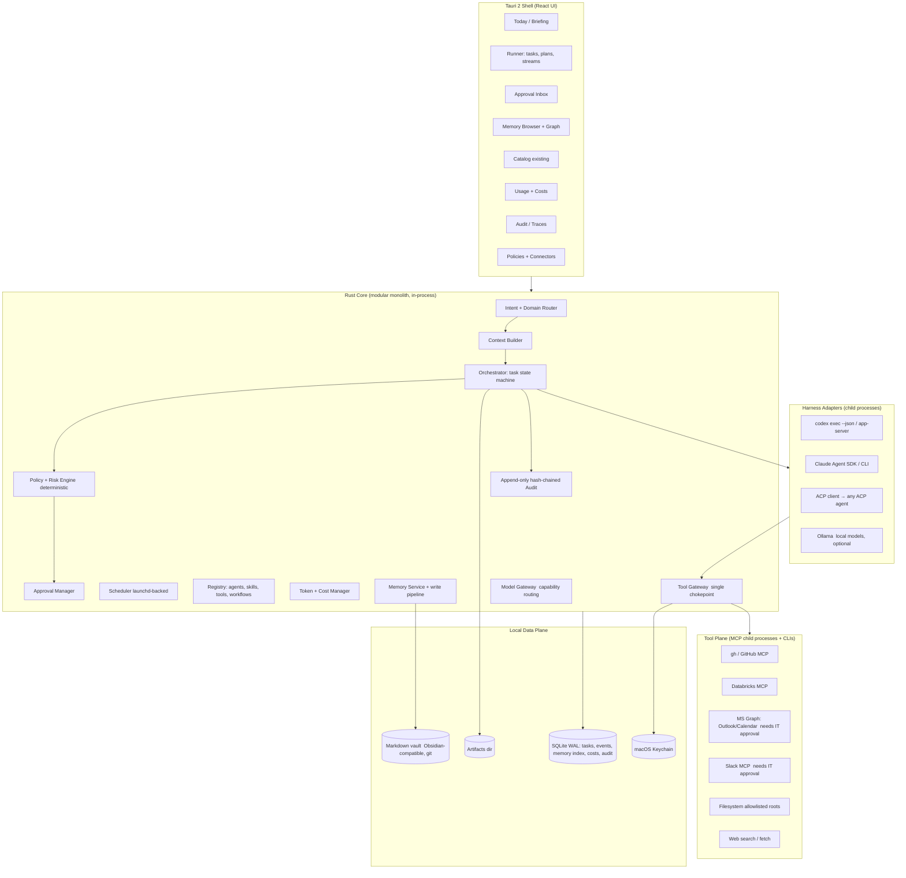

# Agentic OS — Local-First Architecture v1.1

Status: draft for review · Date: 2026-07-20 (v1.0: 2026-07-15) · Supersedes: "Fabio Agentic OS — Reference Architecture v0.1" (evaluated below)
Companion document: `docs/UI-SPEC.md` (developer-ready UI specification)
The app was renamed from "Agent Control" to "Agentic OS" on 2026-07-20; the repository directory and internal identifiers (bundle id, crate name) are unchanged.

## 1. Purpose and hard constraints

Agentic OS is a personal, local-first agentic operating system: a single local system that understands natural-language requests, retrieves the right context across work / PlanPhysique / personal domains, plans multi-step work, uses tools, executes long resumable workflows, asks approval before sensitive operations, and keeps memory, audit trail and data separation.

Hard constraints, in priority order:

1. **Always local.** Everything runs on Fabio's Mac. No exposed ports, no public gateway, no cloud control plane. Only outbound calls (model providers, approved connectors) leave the machine. This is non-negotiable: the OpenClaw crisis (CVE-2026-25253 one-click RCE, 20k+ exposed gateways, ClawHavoc skill-registry poisoning) proved that a personal agent gateway reachable from the network is the single biggest mistake in this product category.
2. **Single user, multiple domains.** One human, strict data separation between `work`, `planphysique`, `personal`, `family`, `finance`, `research`.
3. **Subscription-first economics.** The agent runtime is the CLIs Fabio already pays for (Codex, Claude Code). Raw API keys are the exception (cheap classification, embeddings), not the default.
4. **Buildable by one person.** Every component must be maintainable by a solo engineer in evenings. Anything that requires operating infrastructure is out.
5. **Corporate-safe.** VFC data never leaves approved channels. Connectors to Outlook/Slack/Databricks go through IT-sanctioned auth, and every side effect is logged and approvable.

## 2. Verdict on Reference Architecture v0.1

The v0.1 proposal is architecturally right and operationally wrong for this context. It describes an enterprise multi-tenant platform; we are building a desktop OS.

### Principles we keep (unchanged)

- **Deterministic shell, agentic core.** LLMs interpret, classify, plan, synthesize, propose. Authorization, credentials, approvals, persistence, scheduling, budgets are deterministic services. This is the load-bearing idea of the whole design.
- **Approval by risk, not by agent involvement.** The risk matrix (§8) drives approvals.
- **Explicit state.** Every task is a persisted state machine, never just conversation history.
- **Four-tier memory** (working / episodic / semantic / procedural) with a controlled write pipeline.
- **Tool gateway as single chokepoint** for every side effect.
- **Provider-neutral model access** via capability-based routing.
- **Single entry point, bounded contexts** per domain.
- **Observability and evaluation** as first-class features.

### Principles added in v1.1

- **One daily surface (anti-sprawl).** Every scheduled routine delivers its output into the Today brief by default. A routine may only get its own surface/notification channel with an explicit justification recorded in its workflow definition. Rationale: field evidence shows personal-OS builders drown in self-inflicted scheduled tasks ("information overload") until output is consolidated into a single daily view.
- **Three visibility tiers, not two.** (1) *Approvals* — actions that block on a human decision. (2) *Activity digest* — low-risk actions auto-approved by policy, surfaced passively in Today ("done without asking, here's the list"). (3) *Audit* — the forensic, hash-chained record. Auto-approved actions must never be invisible; they must also never demand attention.
- **Successful runs become skills.** Episodic memory (a run that went well) must have a one-click bridge into procedural memory (a reusable skill). See "Skill distillation" in §6.
- **Every domain has an ontology with a target direction.** Each domain declares its work categories and, per category, whether time spent should move toward `automate`, `assist`, or stay `human`. Usage reports time mix against these targets, turning the one-off "time audit" into a living instrument.

### What we replace (cloud → local mapping)

| v0.1 proposal | v1.0 decision | Why |
|---|---|---|
| Azure Container Apps / AKS / Foundry | Tauri 2 desktop app (existing) | Local-always; zero infra to operate |
| 11 microservices | Modular monolith: Rust crates with enforced module boundaries | One person; same contracts, in-process |
| LangGraph + Temporal | Rust orchestrator: state machine persisted in SQLite | The durable-execution needs (retry, resume, approval-gates, timers) fit in ~1 crate; the *agent loop* is NOT rebuilt — see below |
| Custom agent runtime | **Harness adapters**: `codex exec --json` (JSONL events), Claude Agent SDK/CLI, and an ACP client | Claude Code and Codex already ARE production agent loops (tools, permissions, subagents, sandboxing) billed on subscriptions. Rebuilding them with LangGraph is negative-value work in 2026 |
| PostgreSQL + Redis + Kafka + object storage | SQLite (WAL) + filesystem | SQLite is the system of record, event log, FTS index and vector store (FTS5 + sqlite-vec). Artifacts live on disk. No cache tier needed at desktop scale |
| pgvector / Azure AI Search | SQLite FTS5 now; sqlite-vec + local embeddings (Ollama) when hybrid search proves needed | Start keyword+recency+domain; add vectors on evidence, not by default |
| OIDC / Entra ID / MFA | macOS user session + Keychain (Tauri keyring) + optional app lock; SQLCipher for `finance`/`family` DBs | Single user on own hardware; identity plane is the OS |
| Web/mobile/BFF/SSE channels | The Tauri app IS the channel. Tauri IPC + capabilities is the trust boundary. No HTTP server | "No listening ports" is a security feature, not a limitation. Remote access, if ever, via Tailscale-only in a much later phase |
| Gmail / Google Calendar | Microsoft Graph (Outlook/Calendar/Teams), Slack, Zoom — Fabio's actual stack; GitHub via `gh`; Databricks MCP | Matches VFC reality; Graph and Slack need IT approval → later phase, local sources first |
| Azure Service Bus / Event Grid | Append-only `events` table + in-process dispatch; launchd for wake-up scheduling | Event sourcing "lite": same auditability, zero brokers |
| App Insights + OTel collector | Per-run traces in SQLite + trace viewer in the app; optional OTLP export later | Observability yes, infrastructure no |

### What v0.1 misses (2026 additions)

1. **ACP (Agent Client Protocol).** Now a cross-vendor standard (JetBrains, Zed, Neovim, VS Code, Microsoft Intelligent Terminal). One ACP client adapter makes Agentic OS front-end to *any* compliant agent (Claude Code, Codex via codex-acp, Gemini CLI, Copilot CLI) without per-vendor code.
2. **Skills/AGENTS.md ARE procedural memory.** The harnesses already consume skills, AGENTS.md, claude.md. Agentic OS's existing Catalog discovery (2,545-line `discovery.rs`) is the procedural-memory registry, nearly for free. Procedural memory = versioned files the harnesses natively read; no new runtime needed.
3. **Markdown vault as semantic memory.** Human-readable, Obsidian-compatible, git-versioned, portable across agents. The DB indexes it; it never becomes an opaque store.
4. **Memory as attack surface.** ClawHavoc wrote payloads into MEMORY.md/SOUL.md. All retrieved content (memory included) is untrusted data: wrapped, never interpreted as instructions; writes go through the admission pipeline (§7).

## 3. Target architecture



### Module responsibilities (Rust crates under `src-tauri/`)

- **orchestrator** — task decomposition, plan versions, step execution, dependencies, retry/timeout, suspend/resume, compensation. State machine: `CREATED → CLASSIFIED → PLANNED → RUNNING → WAITING_FOR_TOOL | WAITING_FOR_APPROVAL → RESUMING → VERIFYING → COMPLETED | FAILED | CANCELLED | PARTIALLY_COMPLETED`. Every transition writes an event row.
- **router** — hybrid classification: deterministic rules first (domain keywords, source, schedule origin), one cheap LLM call for ambiguity, confidence score. Low confidence ⇒ read-only mode + narrower tool set, exactly as v0.1 prescribed.
- **policy** — versioned rules as TOML files in-repo (`policies/`), evaluated deterministically: (action, domain, data-classification, cost) → allow | require_approval | deny. LLMs never touch this path.
- **approval** — pending-approval queue in DB + Approval Inbox UI + native notification. Blocking a step never loses state: the task parks in `WAITING_FOR_APPROVAL` and resumes on decision (same pattern as LangGraph interrupts, without LangGraph).
- **context** — the pipeline from v0.1 kept intact but local: domain filter → conversation state → preferences → FTS search → temporal filter → permission filter → dedup → compression → source citations → final prompt. Task-specific, permission-aware, time-valid.
- **registry** — extends existing `discovery.rs`: agents (= named configurations), skills, tools, workflows, MCP servers, with per-domain grants.
- **toolgw** — every tool/MCP call passes here: allowlist, JSON-schema validation, input sanitization, timeout, rate limit, idempotency key, secret injection (from Keychain, never in prompts), output redaction/DLP tagging, audit row. Tools declare the v0.1 contract (`side_effect`, `risk_level`, `supports_dry_run`, `idempotent`, `data_classifications`, `allowed_agents`).
- **modelgw** — `invoke(capability, data_classification, max_cost, latency_sla)`. Routes: fast classification → cheap/local model; deep reasoning/coding → harness on subscription; embeddings → local (Ollama) or dedicated; `work`-classified data → only VFC-approved endpoints. No vendor client instantiated inside agents.
- **memsvc** — four tiers (§6) + admission pipeline (§7).
- **budget** — extends the existing usage snapshot: token accounting per run/domain, plan-credit awareness, cost ceilings enforced pre-flight by policy.
- **audit** — append-only table with hash chaining (each row carries `sha256(prev_hash || row)`), plus periodic anchor of the head hash into a location outside agent-writable paths. The agent never gets write access to audit or policies.

### Agent topology

Supervisor–specialist, no free agent-to-agent chat (v0.1 was right). Concretely:

- The **supervisor is the deterministic orchestrator** plus one router call. It is not an LLM "manager agent".
- **Domain agents are configurations, not processes**: a named bundle of (system prompt, skills subset, tool grants, memory scope, model capability, policy profile) executed on a harness adapter. `Executive`, `Engineering`, `PlanPhysique`, `Research`, `Finance`, `PersonalOps` are rows in the registry, not services.
- **Reviewer is a workflow step**, not a standing agent: a second model pass (different model where it matters) checking completeness, groundedness, citations, policy compliance before an artifact reaches Fabio or a side effect executes.

## 4. Harness strategy (the core bet)

Agentic OS does not implement an agent loop. It orchestrates the best loops that exist:

1. **Codex adapter (first).** Spawn `codex exec --json` as a child process; parse the JSONL ThreadEvents (commands, file changes, messages) into orchestrator events streamed to the Runner UI. `codex app-server` / `remote-control` is the richer protocol when sessions need steering. Sandbox and approval settings pinned per policy profile. Zero API keys: ChatGPT subscription auth.
2. **Claude adapter (second).** Claude Agent SDK (TypeScript from the Tauri side or via CLI): same loop as Claude Code — tools, permissions, subagents, MCP — drivable programmatically; subscription plans include monthly Agent SDK credits since June 2026.
3. **ACP adapter (third, the future-proofing).** One Agent Client Protocol client over stdio makes any compliant agent pluggable (codex-acp, Claude Code, Gemini CLI, Copilot CLI). When a new model/agent ships, it is a registry entry, not a code change: "focus on the system, not the model", implemented with a protocol instead of a prompt.
4. **Ollama (optional).** Local models for classification, embeddings, redaction pre-passes — the tasks that are frequent, cheap and privacy-sensitive.

## 5. Data architecture

- **SQLite (WAL)** — single system of record: `tasks`, `task_steps`, `plans`, `events` (append-only), `approvals`, `tool_calls`, `memories` (index + metadata), `agents`, `tools`, `workflows`, `policies_versions`, `costs`, `audit` (hash-chained), `traces`. FTS5 virtual tables over memories/artifacts; sqlite-vec column when vectors land.
- **Markdown vault** — semantic + episodic human-readable layer, Obsidian-compatible, git-versioned. Subtrees per domain (`vault/work/`, `vault/planphysique/`, `vault/personal/`, …) so domain isolation is enforceable by path.
- **Artifacts dir** — run outputs (reports, diffs, drafts, transcripts) addressed from DB rows.
- **Keychain** — all secrets. Nothing in prompts, env files or the DB. Only the Tool Gateway reads them.
- **SQLCipher** (phase 5) — separate encrypted DB files for `finance` and `family`.

Task record (kept from v0.1, unchanged shape): `task_id, workspace/domain, status, goal, plan_version, current_step, input_refs, tool_calls, approval_requests, artifacts, cost{tokens, estimated_amount}, created_at, updated_at`.

## 6. Memory architecture

| Tier | Contents | Local storage |
|---|---|---|
| Working | current request, plan, intermediate results, pending approvals | `tasks`/`task_steps` rows (SQLite) — survives restarts by construction |
| Episodic | what happened: decisions taken, runs, failures, sent items | `events` + artifacts + dated vault notes |
| Semantic | stable facts: people, projects, preferences, architectures, decisions | markdown vault + SQLite FTS index (+ vectors later) |
| Procedural | how to do recurring things | **skills / AGENTS.md / claude.md / workflow TOML — versioned files the harnesses natively consume**, managed via Catalog |

Every memory carries: origin, date, confidence, temporal validity, domain, sensitivity, optional expiration, provenance links; correctable and deletable. Memory is readable by Fabio in Obsidian at all times — no opaque memory.

**Skill distillation (v1.1).** Every successfully completed task exposes a "Distill to skill" action. The distiller takes the run trace (plan, tool calls, corrections, final artifact), asks a model to extract the reusable procedure, and emits a candidate skill file as a memory-write proposal (same diff-approval pipeline as any vault write). On approval it lands in the skills directory the harnesses already consume and appears in Catalog with provenance (`distilled from task {id}`). This is the episodic→procedural bridge: the 1%-user workflow becomes a reusable asset instead of staying locked in one person's (or one run's) history.

**Domain ontologies (v1.1).** `ontology/{domain}.toml` declares the work categories of each domain and their target direction:

```toml
# ontology/work.toml
[[category]]
id = "newsletter-qa"
label = "Newsletter QA vs brand style guide"
direction = "automate"      # automate | assist | human

[[category]]
id = "design-review"
label = "Design and architecture review"
direction = "human"
```

Tasks and workflows are tagged with a category; Usage aggregates time and cost per category and renders it against the declared direction (an `automate` category whose human-time grows is a red flag; a `human` category losing time to agents is too). Ontology files are git-versioned like policies.

## 7. Memory write pipeline (admission control)

No LLM writes directly to persistent memory. Pipeline (from v0.1, kept): extract candidate facts → classify type + sensitivity → dedup → source/confidence check → retention + consent policy → **user approval for `personal`/`family`/`finance` and for any cross-domain fact** → persist → provenance links. Writes land as git-diffable vault changes: the Memory UI shows diffs, not silent mutations. Rationale: ClawHavoc-style memory poisoning becomes a reviewable diff, not a silent compromise.

## 8. Policy and approval matrix (v1 defaults)

| Action | Risk | Behavior |
|---|---|---|
| Read local files in allowlisted roots | low | automatic |
| Read email/calendar (once connected) | low | automatic |
| Draft email/message/PR description | low | automatic |
| Write inside a git worktree/branch | medium | automatic in isolated branch |
| Create calendar event | medium | preview + confirm |
| Send ordinary email/Slack message | medium | approval (configurable per recipient/domain) |
| Send legal/HR/health communication | high | mandatory approval |
| Push branch / open PR | medium | approval |
| Merge to main | high | mandatory approval |
| Deploy non-prod | high | follows CI/CD policy, approval |
| Deploy prod | critical | out of scope for autonomous execution |
| Delete data / rewrite vault history | critical | strong confirmation, never autonomous |
| Payments / banking writes | critical | out of scope |
| Grant a new tool/connector to an agent | high | mandatory approval |
| Memory write to personal/family/finance | high | approval via write pipeline |

Policies are TOML in `policies/`, git-versioned; the engine is pure Rust; prompts cannot modify them.

## 9. Security model

Threats (ranked by 2026 field evidence): indirect prompt injection from email/documents/web, memory poisoning, malicious/compromised MCP servers and skills, credential exposure, cross-domain leakage, unverified side effects, cost explosion, over-autonomy.

Controls:

- **No listening ports.** Tauri IPC only; capabilities pinned in `src-tauri/capabilities/`.
- **Untrusted-content discipline.** Everything retrieved (emails, web, reviews, memory) is wrapped as data with source labels; instructions in content are never executed; the Reviewer step checks for injection-shaped output before side effects.
- **Least privilege per task.** Tool grants resolved per (agent, domain, task-risk) at gateway time; default read-only.
- **Secrets** only in Keychain, injected by the gateway, never visible to models.
- **Skill/MCP supply chain**: only allowlisted servers; new skills/servers diff-reviewed and run first in a no-side-effect profile (the OpenClaw lesson).
- **Egress allowlist** per tool at the gateway; sandboxed harness execution (Codex/Claude sandboxes already enforce this at their layer).
- **Immutable audit** (hash chain + external anchor), append-only events, run history — the agent cannot rewrite its own past.
- **Budget guards**: per-task and per-domain token/cost ceilings enforced pre-flight.

## 10. Observability and evaluation

Every run records: input, domain, intent, model, prompt version, retrieved memory, tools available/chosen, arguments, results, policy decision, approvals, tokens, latency, cost, errors, final output, user feedback. Stored in `traces`; rendered in the Audit/Traces UI.

Metrics (start small): task success rate, human correction rate, approval correctness, workflow completion rate, tool failure rate, cost per task/domain, p95 latency.

Evaluation: a golden dataset of Fabio-real tasks (briefing generation, decision retrieval, repo analysis, newsletter QA verdicts) re-run on demand — especially before swapping models/harnesses (the registry makes A/B trivial). Simulations: tool failure, injection-laced document, contradictory memory, denied approval, duplicate event.

## 11. Repository structure (evolution, not rewrite)

```
agentic-os/
├── src/                      # React UI (existing)
│   └── features/
│       ├── today/            # NEW briefing surface
│       ├── runner/           # becomes real: plans, streams, history
│       ├── approvals/        # NEW approval inbox
│       ├── memory/           # becomes real: vault browser, diffs, graph
│       ├── catalog/          # existing
│       ├── usage/            # becomes real: costs
│       └── audit/            # NEW traces viewer
├── src-tauri/
│   ├── src/                  # thin command layer (existing pattern)
│   └── crates/
│       ├── orchestrator/  ├── policy/     ├── approval/
│       ├── context/       ├── registry/   ├── toolgw/
│       ├── modelgw/       ├── memsvc/     ├── budget/
│       ├── audit/         ├── sched/      └── harness/   # codex | claude | acp
├── agents/                   # domain agent configurations (TOML)
├── workflows/                # daily-brief/ meeting-to-memory/ newsletter-qa/ repo-analysis/ research-monitor/
├── ontology/                 # {domain}.toml — work categories + target direction (v1.1)
├── policies/                 # actions/ domains/ approvals/ retention/
├── prompts/                  # routing/ extraction/ review/  (versioned)
├── evaluations/              # datasets/ graders/ simulations/
└── docs/                     # this file, decision log, runbooks
```

## 12. Roadmap

**Phase 0 — Foundation hygiene (days).** `git init` + first commit; this document; decision log; `policies/` and `agents/` scaffolds; CI-less but reproducible build.

**Phase 1 — Core OS (weeks 1–3).** Task model + orchestrator state machine in SQLite; Codex harness adapter (`codex exec --json`) with live event streaming in Runner; run history; append-only audit; policy engine v0 (static matrix) + Approval Inbox; token/cost capture per run. *Read-only tool grants only.* Acceptance: a prompt or a Catalog routine runs through Runner, streams events, parks on an approval, resumes, and leaves a complete trace.

**Phase 2 — Memory and context (weeks 4–6).** Markdown vault + FTS index; memory write pipeline with diff approvals; context builder v1; decision log; procedural memory wired = Catalog manages skills/AGENTS.md the harnesses consume; Memory UI; **"Distill to skill" action on completed runs** (v1.1). Acceptance: a run cites vault sources in its trace; a memory write appears as an approvable diff; a completed run can be distilled into a skill that appears in Catalog with provenance.

**Phase 3 — Workflows and scheduler (weeks 7–9).** Workflow definitions (TOML) + scheduler (in-app + launchd wake, catch-up on start) + native notifications; **Today brief as the single delivery surface for all routines + Activity digest of auto-approved actions** (v1.1); **domain ontology files + time-mix reporting in Usage** (v1.1). First three workflows, all on local data (no IT approvals needed): **(a) Daily Brief** from local sources (git repos status, open tasks, vault decisions, research feeds); **(b) Meeting → Memory** (intelligent-transcription-system output → summary, decisions, action items → vault + follow-up draft); **(c) Newsletter QA** (campaign HTML vs brand style-guide → violations report). Acceptance: all three run scheduled or on-demand with history and costs; their output lands in Today, not in separate channels.

**Phase 4 — Connectors (weeks 10+).** MCP gateway hardening; Claude adapter + ACP adapter; `gh`/GitHub; Databricks MCP (incrementality monitoring); then Microsoft Graph (Outlook/Calendar) and Slack pending VFC IT approval → unlocks Inbox-to-Action and the full Executive brief.

**Phase 5 — Domain agents (months).** PlanPhysique agent (roadmap/backlog/analytics on its own domain), Research monitor (continuous source watching with novelty detection), Finance (local statement imports, SQLCipher), Personal Ops. Reviewer step becomes default on all side-effectful workflows.

**Non-goals (permanent unless revisited):** payments and banking writes, autonomous prod deploys, medical decisions, free-form multi-agent chat, self-modification of Agentic OS's own code or policies, any publicly reachable endpoint.

## 13. Decision record (answers to v0.1 §20)

1. Managed platform vs custom runtime → **custom local orchestrator + harness adapters** (Codex/Claude/ACP). No Foundry: it solves hosting we don't want.
2. LangGraph alone or + durable engine → **neither**; Rust state machine + SQLite gives durable execution at desktop scale. Revisit only if this ever becomes a server product.
3. Postgres+pgvector vs dedicated vector store → **SQLite + FTS5 now, sqlite-vec when hybrid retrieval proves necessary.**
4. MCP as primary tool interface → **yes, behind the internal Tool Gateway** which owns identity, approval, audit, redaction (MCP is interop, not governance — v0.1 was right).
5. Model gateway custom vs APIM → **custom, thin, capability-based.**
6. Multi-tenant readiness → **no.** Single-tenant; domains are the isolation unit.
7. Full event sourcing vs simplified log → **append-only events + hash-chained audit** (event-sourcing-lite).
8. What enters persistent memory → anything with provenance passing the admission pipeline; `personal/family/finance` and cross-domain always via explicit approval.
9. Mandatory approvals → all sends, push/merge, deletes, new tool grants, sensitive-domain memory writes (§8).
10. Preview features → allowed only inside the `research` domain, never on side-effectful paths.
11. Routine output delivery → **always into Today**; standalone channels require a recorded justification (anti-sprawl, v1.1).
12. Auto-approved actions visibility → **passive Activity digest in Today**, distinct from Approvals and Audit (v1.1).
13. Episodic→procedural bridge → **"Distill to skill" on completed runs**, through the standard diff-approval pipeline (v1.1).
14. Time governance → **ontology per domain with target directions**, reported in Usage (v1.1).
